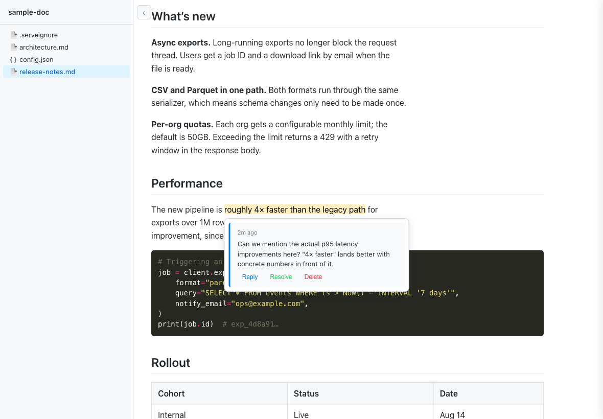
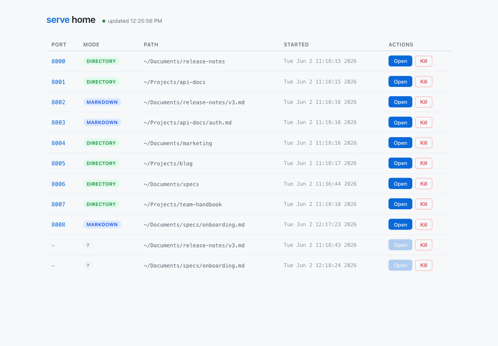
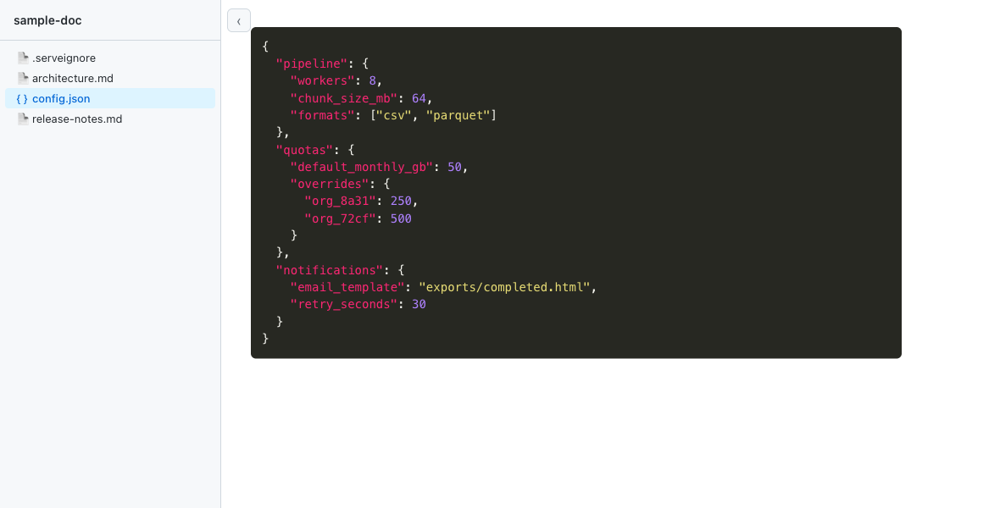

# serve

Open a document in your browser. Highlight a sentence. Leave a comment. An AI agent reads it from the command line, updates the file, marks it resolved.

That's the loop `serve` is built for.



`serve` is a local document previewer for markdown, HTML, code files, PDFs, images, and directories of all of those. It opens a browser tab, live-reloads on save, and renders everything sensibly out of the box. The piece you won't find in other previewers is the comment system: select text in the browser, write a note, and the comment is anchored to that exact passage. Source files are never modified — comments live in `~/.serve/comments/` and follow files through `mv` and `git mv`.

## When it's useful

- You're drafting a spec with an AI and want a human reviewer to leave inline comments without an email thread.
- You're reviewing a doc the AI wrote and want to point at specific passages instead of typing free-form feedback.
- You want a Google-Docs-style comment experience for the markdown files you keep in git, without checking comments into the repo.
- You're passing a doc back and forth between yourself and Claude / Cursor / Copilot and want the agent to know exactly which sentences need work.

## The agent loop

```bash
# Serve a draft
serve docs/spec.md

# (You highlight passages in the browser and leave inline comments.)

# Park an agent on the live event stream
serve watch docs/spec.md --new

# Or have it list pending comments on demand
serve comments docs/spec.md
# → JSON: anchor_text, source line numbers, comment text, IDs

# Agent can reply to ask a question or note what it did...
serve reply docs/spec.md <comment-id> "Reworded — does this read better?"

# ...then resolves once the feedback is addressed
serve resolve docs/spec.md <comment-id>
```

`serve watch` emits one JSON event per line: `new_comment`, `new_reply`, `edited`, `resolved`, `deleted`, plus an `initial` replay on startup for every existing unresolved comment. No polling.

## Use with Claude Code

```bash
serve agent-init
```

This is the one command that wires Claude into the loop. It installs a `serve` skill that teaches Claude about `serve comments`, `serve resolve`, and `serve watch`. After running it once, you can say things like *"address the comments on this doc"* or *"watch this file and fix new feedback as it comes in"* — Claude reads, edits, resolves.

Currently supports Claude Code only. Choose user-level scope (`~/.claude/`, available in every project) or project-level scope (`./.claude/`, this project only). Re-run any time to refresh the skill.

## A dashboard for every running instance

Once you start using `serve` for the review loop, you end up with one running per doc you're working on. `serve home` opens a single page that lists every instance, what it's serving, and lets you open or kill any of it with a click.



```bash
serve home            # opens http://localhost:7070
```

The list refreshes automatically as you start and stop instances elsewhere. It works the way Activity Monitor does for processes — discover what's running, jump in, or shut things down.

## Directory mode

Point `serve` at a folder and the sidebar handles every file type without a separate viewer.



| File | Rendered as |
| --- | --- |
| `.md` / `.markdown` | GitHub-flavored markdown + Mermaid + comments |
| `.html` / `.htm` | The HTML itself, with live reload and comments injected |
| Code (100+ languages) | Chroma syntax highlighting |
| `.pdf` | Embedded viewer |
| `.txt` / `.log` / other text | Wrapped `<pre>` block |
| Anything else | Served as a raw static asset |

The sidebar persists expand/collapse state across reloads. Drag the right edge to resize. Drag a file row onto Finder/Explorer (Chromium browsers) and you get a real local copy. Hit **Edit** on markdown, plain text, or `.serveignore` to edit in place; other files open in your normal editor.

## Install

macOS / Linux:

```bash
curl -sSL https://raw.githubusercontent.com/ericbryant24/serve/main/install.sh | sh
```

Windows (PowerShell):

```powershell
irm https://raw.githubusercontent.com/ericbryant24/serve/main/install.ps1 | iex
```

Re-run to update. Or grab a binary from [Releases](https://github.com/ericbryant24/serve/releases/latest).

Verify:

```bash
serve --version
```

If you have an older Python `serve` on PATH, the installer replaces it.

## Usage

```bash
serve document.md           # serve a single file
serve .                     # serve the current directory
serve docs/                 # serve any directory

serve doc.md -p 3000        # specific port
serve doc.md --host 0.0.0.0 # bind elsewhere
serve doc.md --no-open      # skip opening a tab
serve doc.md --data-url     # copy a self-contained data URL to clipboard
```

### Comments

In the browser: select text → click the **Comment** button → type → Ctrl+Enter. Click highlighted text to open the thread; use Reply / Resolve / Delete from the popover.

From the CLI:

```bash
serve comments doc.md           # list all comments as JSON
serve reply doc.md <id> "text"  # reply to a comment (threads under it)
serve resolve doc.md <id>...    # mark one or more resolved
serve watch doc.md              # stream comment events as JSONL
serve watch                     # stream events for every file in the store
serve watch doc.md --new        # only new comments and replies
```

### Managing running instances

```bash
serve list             # what's running (--json for scripting)
serve kill <pid>       # stop one
serve kill --port N    # stop the one on port N
serve kill --all       # stop everything
serve home             # browser dashboard of all running instances
```

## How comments are stored

Comments live at `~/.serve/comments/<key>.json`. **Source files are never modified.**

The key is derived from the file's inode and device number on Unix, so comments follow the file through `mv` and `git mv`. On Windows the key falls back to a hash of the absolute path.

If an external editor rewrites the file atomically (VS Code, JetBrains, vim with default settings — anything using write-temp + `rename(2)`), the inode flips. The store handles this: each `.json` file records its source `path`, and a missing-store read finds the orphan by path and migrates it. Your comment history follows you across editor sessions.

## REST API

While the server is running, comments are also reachable over HTTP:

```bash
curl http://localhost:8000/api/comments
curl -X POST http://localhost:8000/api/comments \
  -H 'Content-Type: application/json' \
  -d '{"text":"...","anchor_text":"...","source_line_start":5,"source_line_end":5}'
curl -X PATCH http://localhost:8000/api/comments/<id> \
  -H 'Content-Type: application/json' \
  -d '{"resolved":true}'
curl -X DELETE http://localhost:8000/api/comments/<id>
```

## Build from source

Requires Go 1.21+.

```bash
git clone https://github.com/ericbryant24/serve.git
cd serve
go install .
```

The binary lands in `$(go env GOPATH)/bin`.

## Finder Quick Action (macOS)

Right-click any file or folder in Finder and choose **Quick Actions → Serve**:

```bash
cd quick-action
sh install-quick-action.sh
```

You may need to `killall Finder` for the action to appear the first time. Re-run to update.
