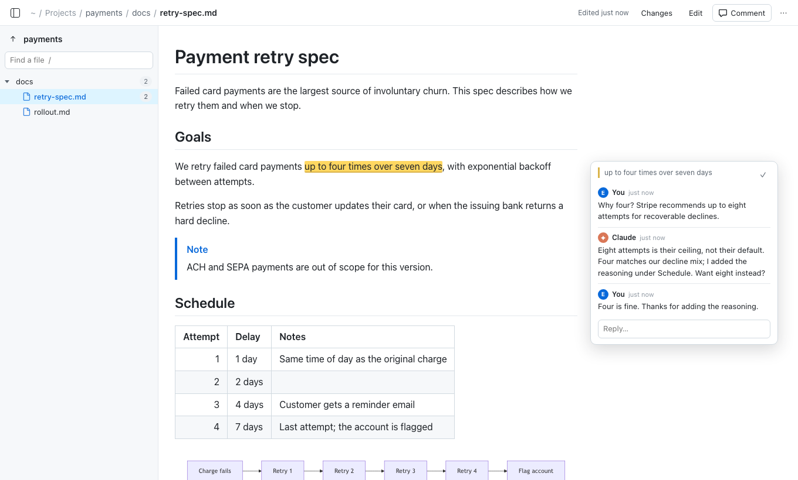
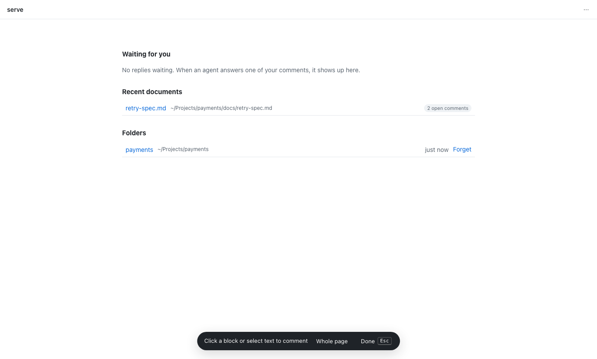
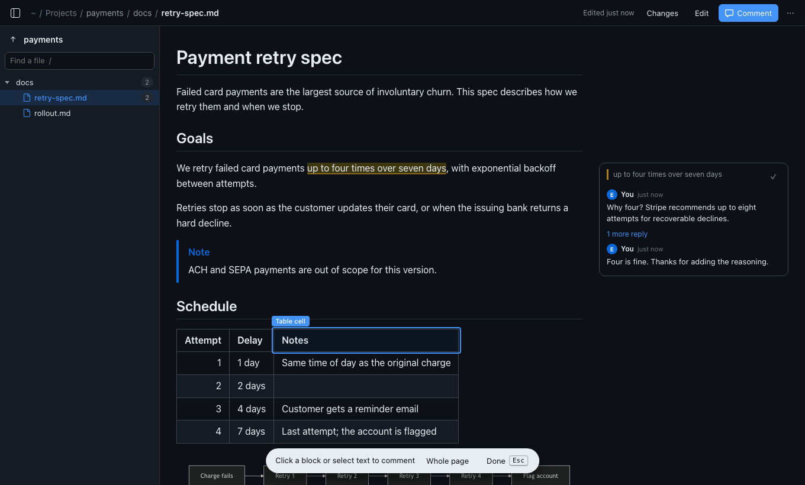

# serve

Open a document in your browser. Select a sentence and leave a comment. An AI agent reads it from the command line, edits the file, replies, and resolves it. The comment stays on its sentence while the file changes.



`serve` is a local previewer for markdown, HTML, code, PDFs, images and folders of all of those. It renders the way GitHub does, updates live as files change, and adds the part other previewers don't have: inline review comments that an agent can work through. Comments are kept in serve's own database, so source files are never touched by commenting, and they follow a file through `mv`, `git mv` and editor saves.

## Install

macOS and Linux:

```bash
curl -sSL https://raw.githubusercontent.com/ericbryant24/serve/main/install.sh | sh
```

Windows (PowerShell):

```powershell
irm https://raw.githubusercontent.com/ericbryant24/serve/main/install.ps1 | iex
```

Re-run to update, or grab a binary from [Releases](https://github.com/ericbryant24/serve/releases/latest). The first run imports comments from older versions of serve (`~/.serve/comments`), leaving the old files in place.

## Open something

```bash
serve docs/spec.md     # a file, with its folder in the sidebar
serve .                # a folder
serve                  # the current folder
```

The first `serve` starts a background server; later ones reuse it and return at once. Every file is at a URL that is its own path, such as `http://localhost:7070/~/Projects/payments/docs/spec.md`, so links and bookmarks keep working across restarts. `http://localhost:7070/` is the start page: threads waiting for your reply, recently commented documents, and the folders you have opened.

serve only shows folders you have opened. The file tree starts at the widest opened folder that holds the file. To start it lower, right-click a folder in the tree and choose **Start the file tree here**; your browser remembers this for files in that folder. The ↑ button above the tree moves it back up, and once it reaches the opened folder, ↑ opens the folder above.



## Comment

- **Select text and press `c`** (or click **Comment**) to comment on it.
- **Press `c` with nothing selected** to enter comment mode: point at any block (a heading, a table, a diagram, a line of code) and click to comment on it, or drag to select text. **Whole page** comments on the document as a whole. `Esc` leaves the mode.
- **In a code or text file**, click a line number to comment on that line; shift-click another to cover the lines between.



Threads sit in the margin beside their highlights. Each has a reply box that stays open, author names (you, or the agent), and **Resolve**. Resolved threads leave the page; **Show resolved comments** in the ⋯ menu brings them back, faded and listed below the open ones, with a dotted underline on their text. Clicking one opens it beside its text. Deleting and resolving can be undone from the notice that appears.

When the text a comment was made on is rewritten, the comment stays on the new text and shows what it used to say (~~up to three times~~ → up to four times). When the text is deleted, a marker shows where it was.

| Key | Does |
| --- | --- |
| `c` | Comment on the selection, or turn comment mode on and off |
| `]` `[` | Next and previous comment |
| `r` | Reply to the comment in focus |
| `e` | Resolve or reopen it |
| `p` | Comment on the whole page |
| `/` | Find a file |
| `?` | All shortcuts |

## The agent loop

```bash
serve comments docs/spec.md                 # open threads, with their current lines
serve reply docs/spec.md a1f3 "Done? Or should SEPA be in scope too?"
serve resolve docs/spec.md a1f3 --note "Changed to four retries."
serve wait docs/spec.md --since 1842 --from human   # block until the next comment
```

`serve comments` prints JSON. Each thread's `source_line_start`/`source_line_end` say where its passage is **now**, after every edit since the comment was made, and `location.state` says whether the text is intact (`ok`), rewritten (`changed`, with `current_text`) or gone (`deleted`). `awaiting` is `agent` when the last message is from a person. Ids can be shortened to any unique prefix.

The listing includes a `cursor`. `serve wait --since <cursor>` returns as soon as anything matching happened after it, including something that arrived before `wait` started, so an agent can list, work, and wait without missing a comment. `serve watch` streams the same events as JSON lines.

```bash
serve agent-init       # install the serve skill for Claude Code
```

After that you can ask Claude to "address the comments on spec.md" or "watch spec.md and handle feedback as it comes in".

## What it shows

| File | Shown as |
| --- | --- |
| `.md` | GitHub-flavoured markdown: tables, task lists, footnotes, `> [!NOTE]` alerts, Mermaid diagrams (served locally, so they work offline) |
| `.html` | The page itself, running in an isolated frame |
| Code and text | Highlighted, with line numbers that are not part of a copy |
| `.pdf`, images | Their own viewers |
| A folder | A listing, with its README |

**Edit** opens the file in an editor with a live preview. If the file changes on disk while you edit (an agent saved it), saving offers to merge both, take theirs, or overwrite. Nothing is discarded without asking.

**Changes** shows what changed in a document since your last comment on it.

Marp decks (`marp: true` in the frontmatter) get a **Present** button, which needs `marp` or `npx` on your PATH.

## Safety

The server answers only this computer. Every request that reads or changes anything needs a token that only serve's own pages carry, so a website open in another tab cannot read your files or write to them. HTML files run in a frame on a separate port with no access to serve at all.

`serve --host 0.0.0.0 <path>` also listens on your network and prints a share link. People with the link can read and comment; they cannot edit files or open other folders.

Raw HTML inside markdown is filtered (scripts and event handlers removed). To keep it unfiltered for folders whose documents embed their own widgets, list them in `~/.serve/config.json`:

```json
{ "raw_html": ["~/Projects/widgets"] }
```

## Other commands

```bash
serve inbox            # threads waiting for the agent, across all documents
serve status           # the background server and the folders it serves
serve stop             # stop it (tabs reconnect when it starts again)
serve export doc.md    # all threads as JSON; --html writes a standalone page
serve gc               # comments on files that no longer exist (--prune removes them)
serve report           # bug reports captured with "Report a problem"
```

**Report a problem** in the ⋯ menu captures the page with every word blanked out, and saves a report you review and export as a zip to send. Nothing leaves your machine on its own.

## Settings

`~/.serve/config.json`, every field optional:

```json
{
  "name": "Eric",
  "port": 7070,
  "markdown": { "hard_wraps": false, "typographer": false },
  "raw_html": [],
  "respect_gitignore": false
}
```

`name` signs comments made in the browser (default: your account's first name). The agent's comments are signed `$SERVE_AUTHOR`, or `agent`. A `.serveignore` in a folder (gitignore-style) hides files from its tree.

## Finder Quick Action (macOS)

```bash
sh quick-action/install-quick-action.sh
```

Then right-click a file or folder and choose **Quick Actions → Serve**.

## Build from source

Requires Go 1.26+.

```bash
git clone https://github.com/ericbryant24/serve.git
cd serve
go build -o serve . && go install .
```

The browser app is TypeScript under `web/src`, bundled into `web/dist` (committed, so building serve needs only Go). After changing it, run `npm ci` in `web/` once, then `go generate ./web`.
